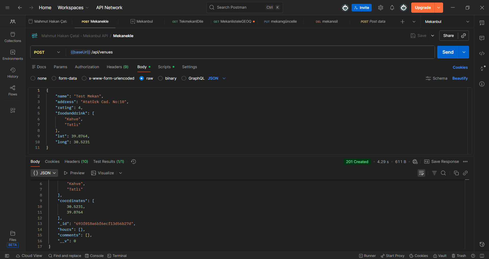
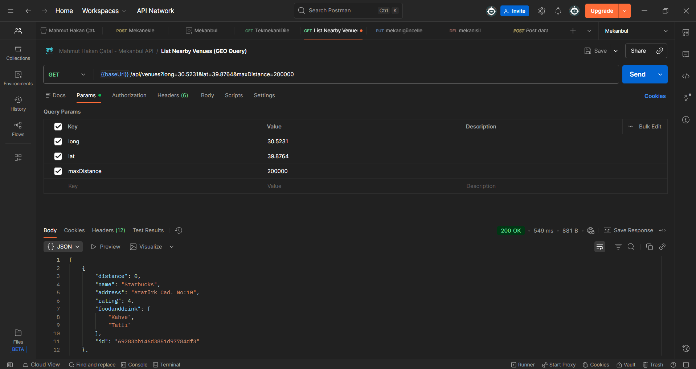
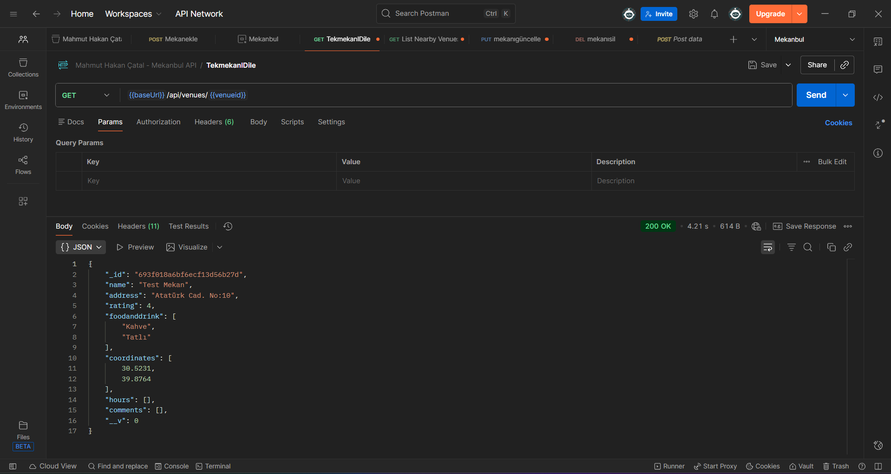
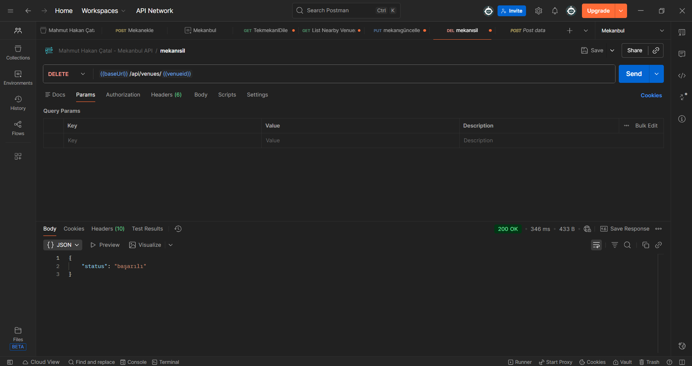

# Mekanbul Backend API

Bu projede geliştirilen API’lerin Postman üzerinden yapılan test sonuçları aşağıda yer almaktadır.

## API Test Ekran Görüntüleri

### POST – Mekan Ekle

### GET – Yakın Mekanları Listele (GEO Query)

### GET – Tek Mekan Getir

### PUT – Mekan Güncelle

### DELETE – Mekan Sil

